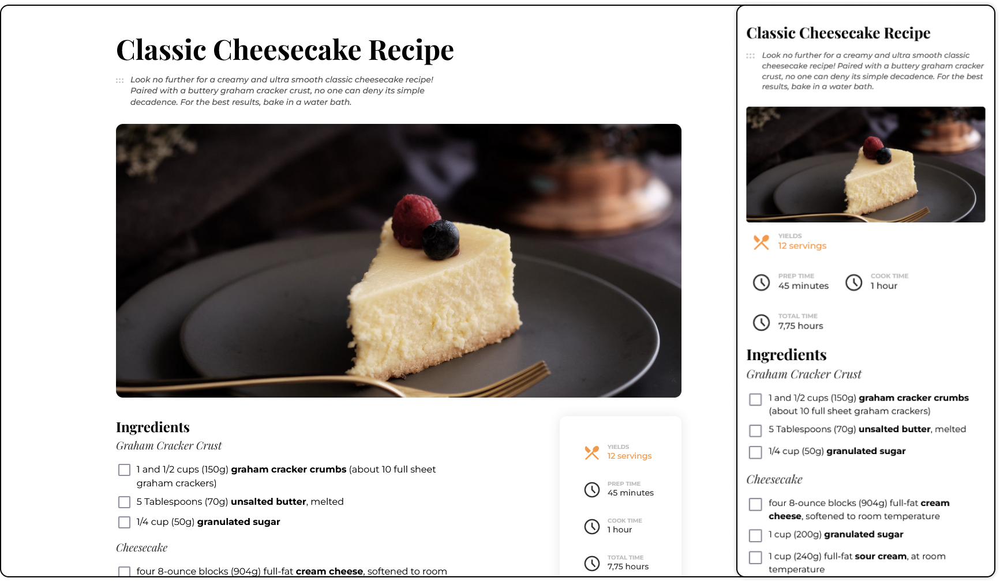
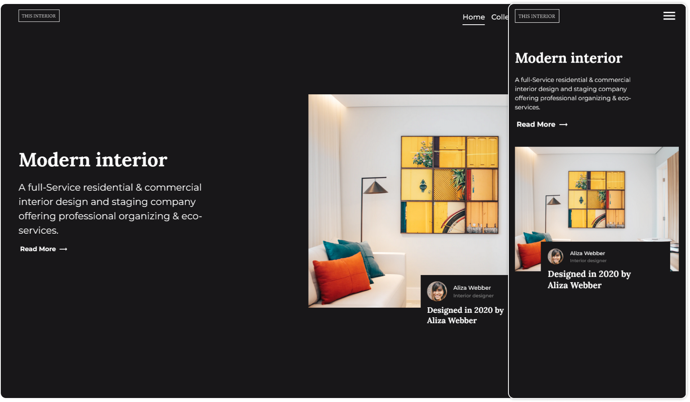
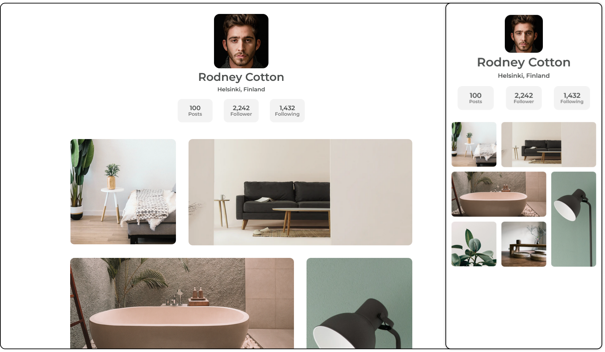
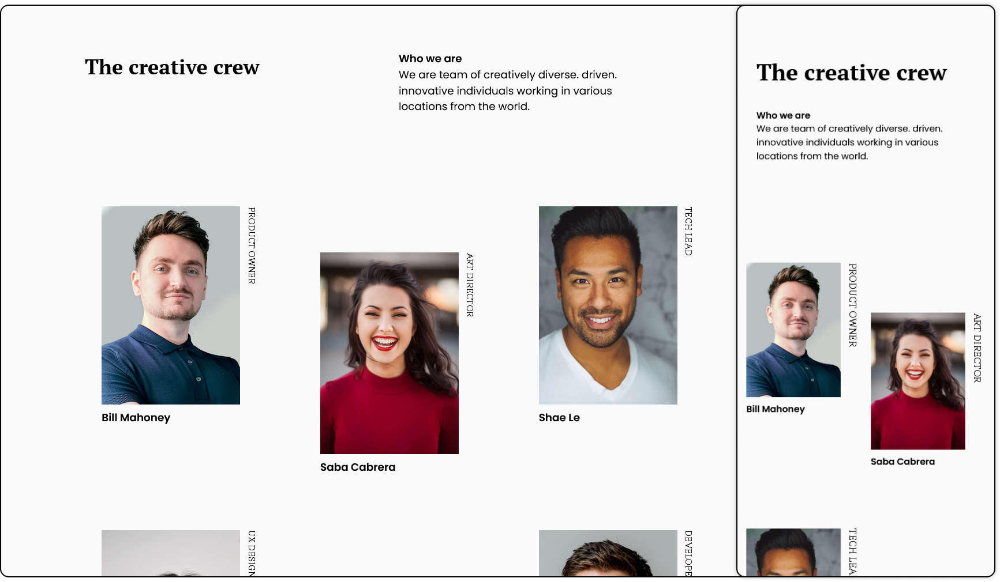
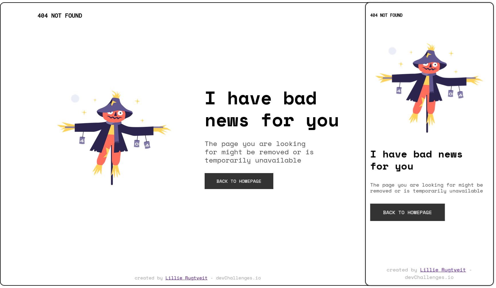

# Responsive Web Challenges
Repository of solutions to Responsive web challenges provided by https://devchallenges.io

## Motivation
I care a lot about a web accessible for everyone, so I decided to challenge  
myself to learn more about making responsive websites. 

## What have I learned?

### Mobile first
I learned that focusing on mobile first helped a lot with making the layout with minimal css.  
When starting to build a website for desktop first it's easy to overcomplicate or struggling  
to adjust it for mobile.

### CSS Clamp
I learned to use clamp to easily make it responsive with minimal media queries.  
This makes the experience smoother for people on desktop having to resize their window.

## Recipe page
[Demo](https://ilillie.github.io/dev-challenges-responsive/recipe-page/)

## Interior Consultant
[Demo](https://ilillie.github.io/dev-challenges-responsive/interior-consultant/)

## My Gallery
[Demo](https://ilillie.github.io/dev-challenges-responsive/my-gallery/)

## My Team page
[Demo](https://ilillie.github.io/dev-challenges-responsive/my-team-page/)

## 404 Not Found
[Demo](https://ilillie.github.io/dev-challenges-responsive/404-not-found/)

